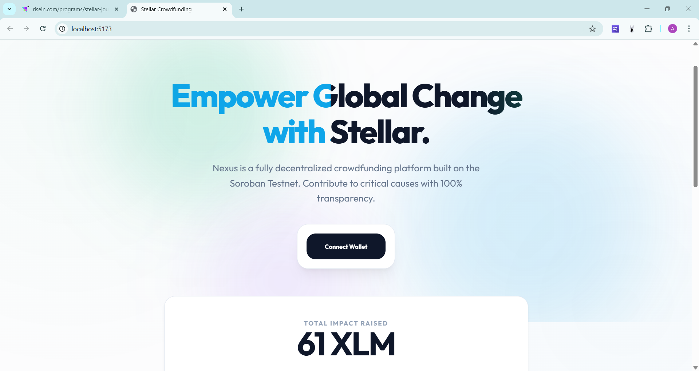
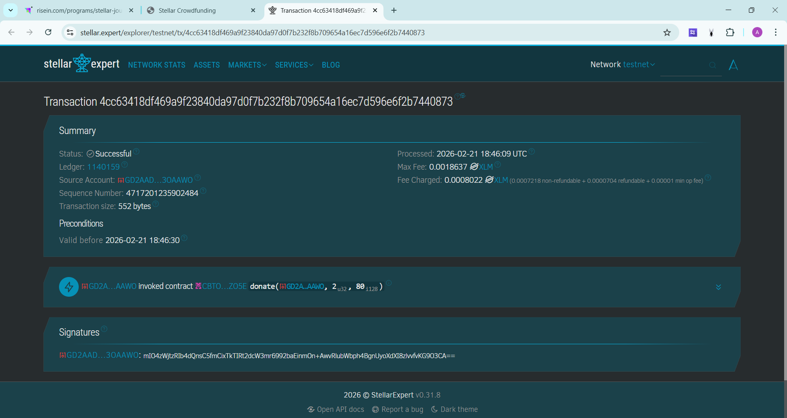
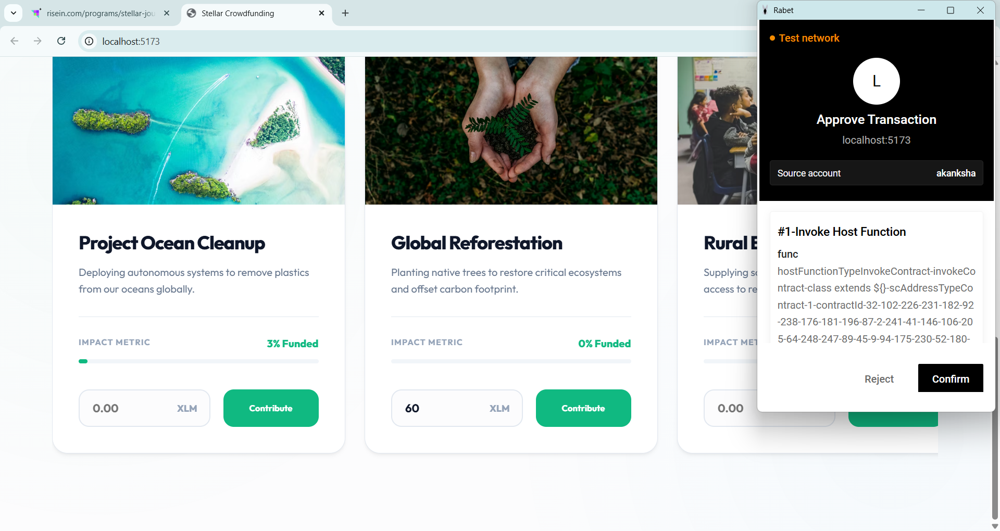

# Stellar Crowdfunding Level 2

A decentralized crowdfunding application built on the Stellar network. This application features multiple wallet integrations (Freighter, Rabet, Lobstr), dynamic smart contract deployment from the frontend, campaign creation and management, real-time transaction event tracking, and downloadable gratitude certificates for donors.

# Features

- **Multi-Wallet Integration**: Connect seamlessly using Freighter, Rabet, or Lobstr wallets.
- **Smart Contract Deployment**: Deploy crowdfunding campaigns directly to the Stellar testnet from the frontend.
- **Real-Time Transaction Updates**: Monitor the status of your transactions directly in the frontend interface.
- **Gratitude Certificates**: Donors receive a shiny, downloadable gratitude certificate upon successfully funding a campaign.
- **Modern UI**: An intuitive layout with polished design, featuring responsive and dynamic elements.

# Screenshots

# Main User Interface

<br/>


# Multi-Wallet Connect


# Contract Deployment Flow

<br/>

<br/>


# Stellar Interaction & Exploring

<br/>


# Features & Extras

<br/>


# Getting Started

# Prerequisites
- Node.js installed
- A Stellar-compatible wallet installed on your browser (Freighter recommended for Soroban testnet compatibility) with Testnet XML XLM loaded.

# Installation

1. Navigate to the `frontend` directory:
   ```bash
   cd frontend
   ```
2. Install the necessary dependencies:
   ```bash
   npm install
   ```
3. Start the local server:
   ```bash
   npm run dev
   ```
   
# Architecture
- **Frontend**: Contains the interactive Vite React app.
- **Contract**: Contains the Stellar Smart Contract configuration needed to execute campaign state on the Soroban testnet.
